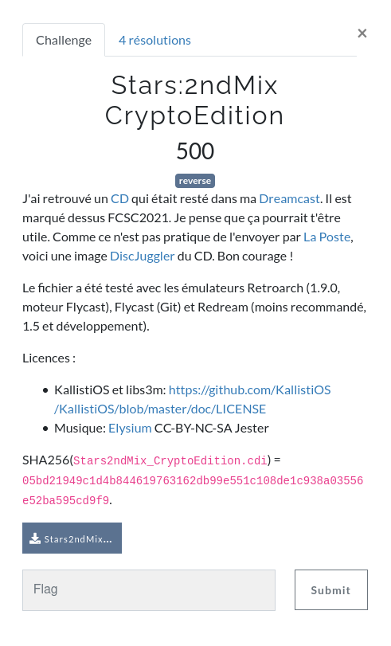

# Stars:2ndMix CryptoEdition [Reverse - 500pts]

This challenge is about reversing a Dreamcast demo to find a secret input.

To start the challenge, we are given a .cdi file and a bit of context.
As the description tells us, a .cdi file is a copy of a CD ROM produced by the software DiscJuggler.

I had no revious experience with Dreamcast before, so my first goal was trying to understand the content of this file.
The description of the challenge indicates us that the file can be used with Dreamcast emulators.
I tested to run the file on Retroarch and Flyarch, and both of them worked well.

Once the disk is loaded into the emulator, you are greeted with an incredible demo:

