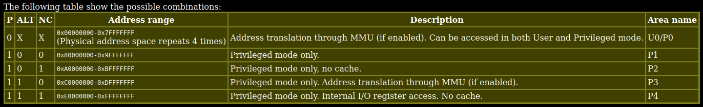

# Stars:2ndMix CryptoEdition [Reverse - 500pts]

This challenge is about reversing a Dreamcast demo to find a secret input.

### Dreamcast ROM format

To start the challenge, we are given a .cdi file and a bit of context.
As the description tells us, a .cdi file is a copy of a CD ROM produced by the software DiscJuggler.

I had no previous experience with Dreamcast before, so my first goal was trying to understand the content of this file.
The description of the challenge indicates us that the file can be used with Dreamcast emulators.
I tested to run the file on [Retroarch](https://www.retroarch.com/) and [Flycast](https://github.com/flyinghead/flycast), and both of them worked well.

Once the disc is loaded into an emulator, we are greeted with an incredible demo:

Here is the music to get the full experience: [Elysium](https://modarchive.org/index.php?request=view_by_moduleid&query=40475) CC-BY-NC-SA Jester

Great, now we know we have to find a secret input of 16 hexadecimal characters that will constitute the flag.
Let's try to understand the .cdi file now.

On linux, we can use iat to extract the content of the .cdi disc image: `iat Stars2ndMix_CryptoEdition.cdi > dreamcast_rom.bin`.
Suprinsigly enough, the `file` command is able to identify the resulting file as a `Sega Dreamcast disc image`.

Finding documentation on the file format of the dreamcast discs is pretty hard, because all the websites on the subject are at least 15 years old, and most of them are down now.
Fortunately, the demo guides us to a website with most of the information we need: (Dreamcast Programming)[http://mc.pp.se/dc/].

After reading docs and examining the content of the `dreamcast_rom.bin` file, here is what I understood:

The file is composed of 2 main parts:
 - IP.BIN, located at the start of the file and of size 0x8000, which acts as bootloader to start the CD-ROM;
 - an ISO filesystem, located after IP.BIN and containing the main program, usually named 1ST_READ.BIN.

When the Dreamcast loads a CD-ROM, the IP.BIN and 1ST_READ.BIN are loaded into memory at offsets 0x8c008000 and 0x8c010000 respectively.
Then the execution of the rom starts in IP.BIN at offset 0x8c008300 with some code to display the license screen and initialize registers and memory.
Finally, the program in 1ST_READ.BIN is excuted starting at addres 0x8c010000.

For more detailed informations, see [IP.BIN and 1ST_READ.BIN](http://mc.pp.se/dc/ip.bin.html)

We can extract IP.BIN and the iso filesystem using `dd`, then mount the iso to obtain 1ST_READ.BIN on Linux, or we can use GDRom Explorer on Windows to get same files.
1ST_READ.BIN is stored scrambled on the filesystem and is descrambled by the dreamcast before being loaded in memory.
We can use the program [scramble.c](mc.pp.se/dc/files/scramble.c) from the previous website to descramble the extracted 1ST_READ.BIN.

### Reverse: SH-4 main program

A quick google search tells us that the architecture of the main microcontroller of the Dreamcast is a Hitachi SH-4 32-bit RISC from Hitachi. The SH-4 architecture is supported by Ghidra, so we can use it to disassemble the content of 1ST_READ.BIN (don't forget to set the load address at 0x8c010000).

The control flow of the program is pretty obscure at first sight, and the exotic architecture doesn't help. To identify the main functions of the binary, I located the strings that are printed during the demo, then searched for references to these strings.

<!-- While I was reversing the previously identified functions, I noticed that several of them shared a strange structure. Instead of just doing a series of actions in order, they were implemented as a switch/case (each case for doing a specific action) and the function was called several times with a different parameter in order to call each case. Here is an exmaple to make things clearer:
 -->

<!-- I don't know if this fuction structure comes from the compiler or from the challenge author. -->

After focusing on reversing mostly these functions, I found that several functions were structured as a switch case, each case implementing a step. These functions are called in a loop, and each time a step is complete, the next one is called. I don't know if this comes from the compiler or the author oh the challenge, but that's pretty strange. Here are the most interesting functions I found:

8c01033c: `main_function`
This is were all the important steps are called, in order:
1) Initialisation the demo: the visuals, the music, print the introduction text, ...
2) Initialisation of more stuff ?
3) Screen to input the flag: the input of the user are processed until it is an A (ask for validation)
4) The flag is checked, and the result is printed

8c01189c: `process_input`
This function is called by `main_function` at step 3. It checks if the user as made an input, and processes it accordingly. The values of the 16 characters are stored at 0x8c07e128. They are stored as bytes with a value between 0 and 15, but are converted to ascii characters before being checked. Each time an input is registered a function `strange_function_1` is called.

8c010d90: `check_flag`
This function is called by `main_function` at step 4 to check the input. The steps of this function are:
1) Encrypt the 16 characters of the input using a slightly modified RC4 algorithm
2) Call `strange_function_2`
3) Call `strange_function_3`
4) Call `strange_function_4`

8c010cc4; `init_RC4`:
The RC4 internal array is initialized in this function. The algorithm used here is not exactly a RC4, as there are 0x300 more rounds on the array after it has been initialized with the key.

At that point of the reversing process, there were some funcions (named `strange_function_n` before) that I wasn't able to understand. These fuctions were reading and writing data at addresses around 0xa080ff00. From what I knew at that moment, these addresses made no sense in the memory map of the dreamcast.

Reading more closely [this page](http://mc.pp.se/dc/memory.html) I understood that the Dreamcast addresses were only 29 bits long, and that the 3 highets bits are used to indicate some modifiers to specify how we want to access the data at that address. Here is the table of possible access modes (from [this page](http://mc.pp.se/dc/memory.html)):

So we should not be searching at address 0xa080ff00, but at physical address 0x80ff00 instead !

After a lot more of googling, I finally found on [this page](https://github.com/Kochise/dreamcast-docs/blob/master/MEMORY/DOCS/memory.txt) and [this one](https://segaretro.org/images/8/8b/Dreamcast_Hardware_Specification_Outline.pdf) (paragraph 2.4) that the address range 0x800000 - 0xa00000 corresponds to the RAM of the sound microcontroller of the Dreamcast: an AICA ARMv7 32-bits RISC from Yahama.

### Reverse: ARM soundcard

So now, in order to progress through the challenge, we have to understand what is happening on the sound card of the Dreamcast.

While I was reversing the main program earlier, I stumbled upon the string "Loading ARM program". I thougth this migth be a interesting track, so I began reversing around the reference to this string.

I managed to identify the function at 0x8c020fe0 as being in charge for loading data to the soundcard. The second parameter of this function is a pointer to the data, and the third is the size of this data. At some point during the Initialisation, this function is called with address 0x8c045750 and the size 0x24C8 as parameters. If we extract the data at this address and start to disassemble it, we can see that it is actually some ARM code. Time for more reversing!
