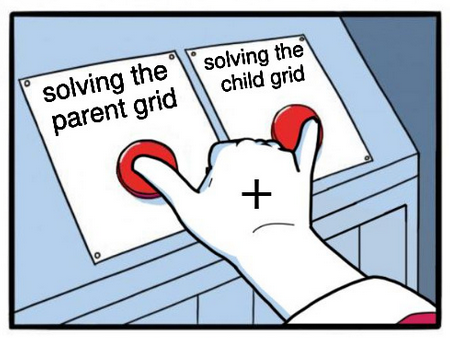

# Triceratops [Reverse - 500pts]


This challenge is about writing a keygen by solving an algorithmic problem.


### Reverse

For this challenge, we are given a binary that checks a username against a serial to test if they are a valid pair. We have to reverse the binary to understand how the check is performed in order to write a keygen, and then test it with random given usernames by connecting to the given address.

The binary is compiled in x64, so we can use Ghidra to disassemble it and understand its content.

The first thing the binary does is asking the user to input a username and a serial (who would have thought).

Right after that, a few checks are perfomed on the structure of the serial. Firstly the size of the serial must be a mutiple of 3. Then the function at address *0x401a61* is used to check if the serial contains only some specific characters: the first and second thirds should be only lowercase characters between 'a' and 'p', and the last third should be only constituted of uppercase 'A' or 'B'.

After those checks are passed, the program creates a child process by calling the `fork()` function. The parent process attaches itself to the chid process using a call to `ptrace(PTRACE_SEIZE, child_pid, 0, 0)`.

In both processes a grid of 16x16 cells is created and initialized based on the value of the username. The pseudo-code of the initialisation is the following:

```C
p = 0 in the parent or 1 in the child
n = 0
i = 0
while (i < 256): # the grid is not filled
    h = sha256(p || n || username)
    b = first 4 bits of h
    for j in range(32):
        if (b < 3):
            grid[i] = b
            i += 1
        b = 4 next bits of h
    n += 1
```

After the initialization, each cells of the grids contains only 0, 1 or 2 and from now on, every operation on the grids will be performed modulo 3.

From this point in the program, the parent and the child process are going to communicate together by sending signals to each other according to the following workflow:
1. The parent waits for a signal from the child by calling `waitpid(-1, child_pid, 0)`;
2. When the child is ready, it raises the interrupt number 3 to send a `SIGTRAP` to the parent;
3. The parent receives the signal and gets the value of the registers of the child by calling `ptrace(PTRACE_GETREGS, child_pid, 0, &registers)`. This way the child can send some data to the parent by placing it inside the `$rdi` register.
4. The parents performs some operations based on the obtained `$rdi` value, then sends back the result to the child by setting its `$rax` register using `ptrace(PTRACE_SETREGS, child_pid, 0, &registers)`;
5. The parent sends a `SIGCONT` to the child by calling `ptrace(PTRACE_CONT, child_pid, 0)`, and the child continues to execute and uses the result in `$rax`.

The next functions are called in parallell in the parent and in the child using the previous communication technique.

The function at *0x4013b1* is used to differentiate the cells of the 2 grids. Whenever a cell has the same value in the parent and in the child, its value is incremented by one in 1 in the parent grid and by 2 in the child grid.

The next function called is the one at address *0x4015f3*. It perfoms some operations on both grids at the same time based on the value of the serial. The characters of the serial are used 3 by 3, taking one of each third each time. The character from the first third is used to determine the x-axis of a cell by calculating the distance if the character to 'a'. The character from the second third is used in the same way to obtain a y-axis of a cell. Finally the character from the last third is used to select a second cell: if the character is an A, then we choose the cell on the rigth of the previously obtained cell, if it is a B, we choose the one below instead.

Here is an example to make things clearer, with 'c' as th first caracter (so x=2), 'b' as the secon (y=1) and A as the third (we use the right neighbour):


After 4 cells have been selected (2 in the parent and the same 2 in the child) the function *0x4011f2* is called to check the values inside these 4 cells against a fixed list of 24 possiblities.

Some selected cells can be considered as invalid if the serial is incorrect, either because it tries operate on cells out of bounds or because the check of function *0x4011f2* failed. When the program detects an invalid operation, the return value is incremented by 1.

On the opposite, if the selected cells are valid, then the values of the 4 cells are updated according to some operations based on their previous combined values.

Once all the operations have been applied, the function at address *0x401aca* is called to check the content of both grids. In the end a serial is considered as valid if no invalid operation was performed during function *0x4015f3* and if both grids only contain a single value (a different one for each grid).


### Algorithmic

We have now fully reversed the binary, but the operations used to check the serial make absolutly no sense.

At that point, I knew that I some sort of algorithm wad hidden inside these strange series of checks and operations, and that I needed to extract it and define it in a more simple way in order to be able to solve it.

While I was trying to address the problem with a different point of view, I noticed that the 2 grids were strongly linked together, because at any point in time, two cells at the same position couldn't have the same value, and each operations applied on the grids had the same impact on both of them.

That when I got the key idea to solve the challenge: the grids shouldn't be solved separately but together by adding them (modulo 3).



We now have to work with a single grid, containing only 0, 1 or 2, which we will now referer to as 3 colors to make things clearer.

Using this approach, we can now fully understand the behaviour of the program:
- The function at address *0x4011f2* is used to check that only adjacent cells of different colors are selected.
- The operation performed on the selected cells during function *0x4015f3* changes the color of these cells to the third color.

Using the previous example, this would be a valid operation:


So now the underlying problem can be reformulated in a simple way:
- We start with a grid randomly filled with 3 colors;
- We can combine 2 adjacent cells of different colors to change them to the third color;
- There must be only one color left on the grid in the end.

To solve this problem, I came up with an algorithm that is bit naive, but works really well:
1. Determine which value (or color) should be left in the grid at the end. To do so, just add all the initial values of the cells (modulo 3).
2. Starting at the top left of the grid, find the first cell which is not at the correct value and which can be combined with an invalid right or below neighbour, and then make a combination;
3. Repeat step 2. until the grid is correctly filled or until you get stuck with no invalid cell to combine;
4. If the grid is stuck, then we have to combine a valid cell with an invalid one. Starting from the opposite corner, find the first invali cell that can be combined with a valid one one the left or on the top. After that, go back to step 2.
5. There is an edge case where the algorithm loops on the 4 cells in the last corner, so we have to detect it and solve it by hand.

Here is an example of the application of the algorithm:


