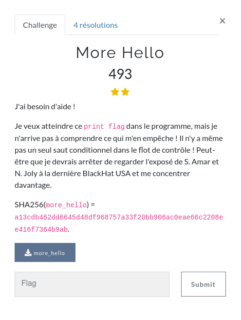
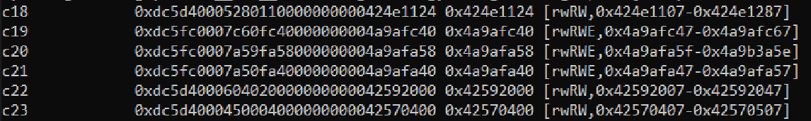
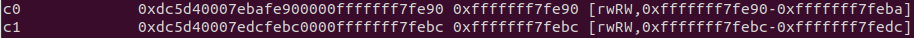
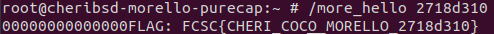

# More Hello: [Reverse - 493pts]


Morello / Aarch64 CHERI ISA reverse challenge



### First look

First let's try the `file` command on the binary:
```
more_hello: ELF 64-bit LSB shared object, ARM aarch64, version 1 (SYSV), dynamically linked, interpreter /libexec/ld-elf.so.1, for FreeBSD 14.0 (1400046), FreeBSD-style, stripped
```

This is an `aarch64` ELF file so opening with Ghidra should not be a problem. However once the file is imported, Ghidra is unable to disassemble it.

Looking again at the description of the challenge, I decided to take a look at the talk which was mentionned:

https://i.blackhat.com/USA21/Wednesday-Handouts/us-21-Security-Analysis-Of-Cheri-Isa.pdf
https://www.youtube.com/watch?v=0lKeSNHGIq4


### CHERI ISA

In this talk, Nicolas Joly and Saar Amar analyse the security of the CHERI instruction set.

CHERI is an extension of some existing instructions sets architectures, such as aarch64, MIPS and RISC-V proposed by researchers at the University of Cambridge.

https://www.cl.cam.ac.uk/research/security/ctsrd/cheri/

It defines additional instructions to keep track of information (called capabilities) about the pointers. The capabilities specify the bounds of the memory referenced by the pointer and if can be read / written / executed. The capabilities are manipulated using additional 128 registers (cXX for aarch64), which contain the original value of the pointer and the associated information.



The aarch64 version of CHERI is called Morello (hence the name of the challenge).

With this information in mind, we can assume that the binary of the challenge is not written in standard aarch64 but in CHERI extended aarch64 (morello). To analys it further, we are going to need a specific toolchain for this architecture.


### Morello toolchain

Fortunately for us, there is Gihtub repository concentrating all the required tools to install the CHERI toolchain:

https://github.com/CTSRD-CHERI/cheribuild

The readme is very detailled and explains what we need to do. We can run `./cheribuild.py run-morello-purecap -d` in order to build a working qemu systemm emulator for Morello on a FreeBSD system. This command also build all the required dependencies, which will also be useful:
- an objdump for morello, which we will use to disassemble the binary;
- a qemu-system-morello binary, to emulate our binary on a FreeBSD system running on morello;
- all the required file for the emulator: a FreeBSD kernel, a filesystem, ...;
- a gdb client for morello to attach to the gdbserver on the qemu system.

This project is really well made as it only requires you to run one or two commands to obtain all the requiried tools (it is even better if you read the readme before starting to complie with random arguments until you realise it was not the correct target hours later...).


### Disassembling

Now we can start to analyse the program by disassembling the binary with the generated objdump. The commented disassembly result is given in the file `more_hello.asm`.

Using readelf, we can first determine that:
- the entry point is at `0x10a10`;
- there are 5 imported functions: `atexit`, `exit`, `__cxa_finalize`, `printf` and `strtoul`.

In the `.plt` section at the end of the disassembly, we can determine the calls to each of the imported functions. The code at the entry point seems to make a bunch of initializations before jumping to the `main` function. In the main function, we can see a call to strtoul and then several calls to printf, where the final one prints the string `"FLAG: FCSC{CHERI_COCO_MORELLO_%x}"`.


### Debugging

To understand the `main` function, I decided to try to debug the program using the `qemu-system-morello` and the asscociated `gdb`. To place the binary in the filesystem of the emulator, it must be copied inside the `cheri/extra-files/` directory, and then we can run the command `./cheribuild.py run-morello-purecap -d` to generate the new filesystem and run the emulator.

When we run the binary in qemu, it crashes with an `In-address space security exception`. This exception occurs because the capability of a pointer was not respected in morello. Using gdb, we can see that this crash occurs inside the call to `trtoul` because the argument passed the function is `NULL`.

Because there was no imported function to get an input from the user and because the final printed string was `"FLAG: FCSC{CHERI_COCO_MORELLO_%x}"`, I suspected that the binary required an integer as an argument to run correctly. I tested this assumption by supplying an integer argument to the program, and with gdb I confirmed that it was indeed used as an argument for the call to strtoul (the integer must be in hexadecimal format).


Once we supply a valid argument, the excution of the program continues past the call to strtoul but another crash of the same type occurs later in the `main` funtion, before the print of the flag is triggered. I assumed that this crash was intentional, but we will come back to it a bit later.


### Main function and check

The workflow of the `main` function is divided in the following steps:
1. Initialize some pointers and there capabilites on the stack;
2. Retrieve the argument and convert it to an integer with `strtoul`;
3. Call 3 functions at `0x111e0`, `0x112a0` and `0x113d0` to process the argument;
4. Perform a loop that may crash at some point;
5. If the program has not crashed, print the flag.

Let's investigate the crash further. It occurs at line `0x11b88` in this code:

```
11b60: e0 0f 40 c2  	ldr	c0, [csp, #48]
11b64: 08 00 40 b9  	ldr	w8, [c0]
11b68: 08 35 00 71  	subs	w8, w8, #13             // =13
11b6c: 2c 02 00 54  	b.gt	0x11bb0 <.text+0x11a0>
11b70: 01 00 00 14  	b	0x11b74 <.text+0x1164>
11b74: e0 07 40 c2  	ldr	c0, [csp, #16]
11b78: e1 03 40 c2  	ldr	c1, [csp, #0]
11b7c: e2 0f 40 c2  	ldr	c2, [csp, #48]
11b80: 48 00 80 b9  	ldrsw	x8, [c2]
11b84: 28 68 68 38  	ldrb	w8, [c1, x8]
11b88: 01 68 68 38  	ldrb	w1, [c0, x8]
...
11b9c: e0 0f 40 c2  	ldr	c0, [csp, #48]
11ba0: 08 00 40 b9  	ldr	w8, [c0]
11ba4: 08 05 00 11  	add	w8, w8, #1              // =1
11ba8: 08 00 00 b9  	str	w8, [c0]
11bac: ed ff ff 17  	b	0x11b60 <.text+0x1150>
```

This code is a loop which is excuted 13 times, with a counter stored in `[csp, #48]`. At each iteration i:
- c0 is loaded from `[csp, #16]` and c1 from `[csp, #0]`;
- x8 takes the value at position i in c1 (x8 = c1[i]);
- w1 takes the value at position x8 in c0 (w1 = c0[x8]);

Looking at c0 and c1 in gdb, we obtain the folloing result:



In the loop, c1 points to buffer wich contents depends on the operations performed on the argument of the program. We can see from gdb that this buffer has a size of 0x20 bytes, defined by a morello capability which was set earlier.

The c0 buffer is empty and has a size of 42 defined in its capability (which was also set earlier). So if x8 is greater than 42 at line `0x11b88`, a `In-address space security exception` will be raised because the program is trying to access data outside of the bounds set by the capabilty of c0.

This means that the first 13 bytes of c1 must be lower than 42 in order to avoid a crash and reach the print flag statement. This loop is used as a way to check the argument of the program an crash it if the input is invalid.


### Hashing algorithm

Now we need to understand the operations performed on the input in order to find an argument that does not triggers the crashes during the check loop.

Looking inside the first function at `0x111e0`, we can notice some very specific constants, starting with `58983 = 0xe667` and `44677 = 0xae85`. These are some constants used in the initialization of a SHA256 algorithm. From that point, we can assume that the 2 functions left correspond to the next step of the hashing algorithm, so we have:
- `0x111e0` = `SHA256_init()`
- `0x112a0` = `SHA256_update()`
- `0x113d0` = `SHA256_digest()`

Using gdb, we can find that the integer argument is passed as 4 bytes to the `SHA256_update` function. We can confirm our assumption by inputing a chosen integer and checking that the result of `SHA256_digest` is indeed the SHA256 of our integer as 4 bytes.


### Finding the good input

To sum up our analisys, the progam takes an integer as an argument, then hashes the 4 bytes of this integer using the SHA256 algorithm, and finally checks that the 13 bytes of the hash are lower than 42, otherwise it crashes.

In order to find such an integer, I created a C program to bruteforce the SHA256 of all the 32 bits integers (`hash_bruteforce.c`). The implementation of SHA256 comes from https://github.com/B-Con/crypto-algorithms.

Thanks to this program, we obtain the correct integer: `0x2718d310`.

We can confirm it works by runnning the binary:



