# Perfect Cell: [Reverse - 495pts]

PS3 reverse challenge
!Not the intended solution

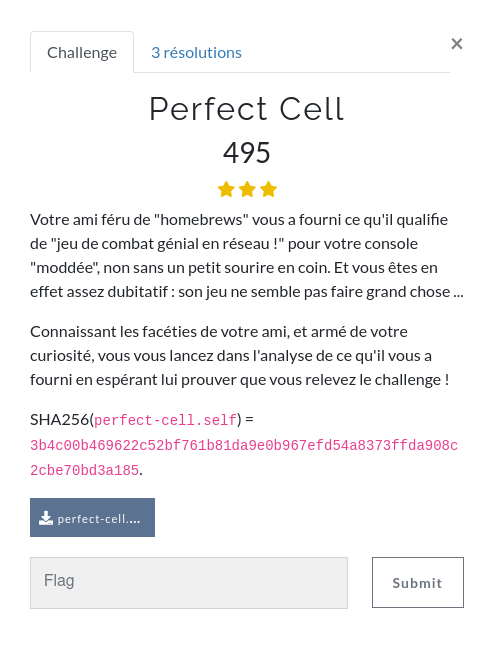

### First look

For this challenge, we are given a `.self` file. After some research and some analysis of the header, I found that SELF is a file format for PS3, PS4 and PSVita executables. SELF stands for Signed ELF: it is a kind of wrapper around the typical ELF format were the sections are signed and encrypted.

This wiki article describes all the specifications of the file format: https://www.psdevwiki.com/ps3/SELF_-_SPRX

The SELF matches the specifcations of the PS3/PSVita format, and was in big endian, so I assumed it was made to run on a PS3.

At first I tried to extract the ELF file contained inside the `.self`, but I was not able to find a working extractor online. So I decided to look for an emulator instead.

### Emulation

To run the binary, I went with the first emulator I found online, which was RPCS3 (https://rpcs3.net/). The installation is pretty straightforward on Linux:
1. Download the `.AppImage` file from the RPCS3 website (https://rpcs3.net/latest-appimage);
2. Download the PS3 system software from the Playstation website (https://www.playstation.com/en-us/support/hardware/ps3/system-software/);
3. Run RPCS3 and import the PS3 software (*File > Install Firmware*).

From there, we can start the binary using *File > Boot SELF/ELF*. RPCS3 also has a fonctionnality to extract an ELF file from a SELF file: (*Utilisties > Decrypt PS3 Binaries*) that we can use to recover the original executable.

When binary starts, we are greated by a window asking us to connect to a network shell.

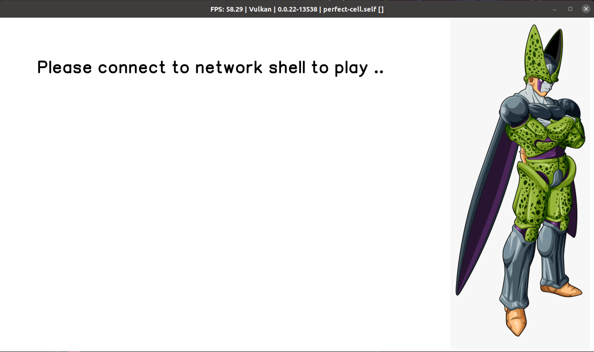

I assumed the program was listening on a local port, so I checked teh listening sockets with `nestat`:

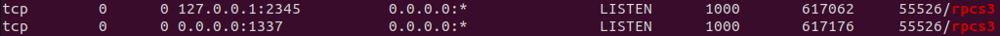

We can see that there are 2 listening sockets openend by rpcs3:
- 2345: This is a gdbserver running on the emulator. It could be very useful to debug the program, however it does not work properly for some reason (breakpoints do not work :/);
- 1337: This the socket of the game we are supposed to connect to.

Once we connect to the socket, the windows state is updated, and we receive a message on the socket asking us to enter an input.

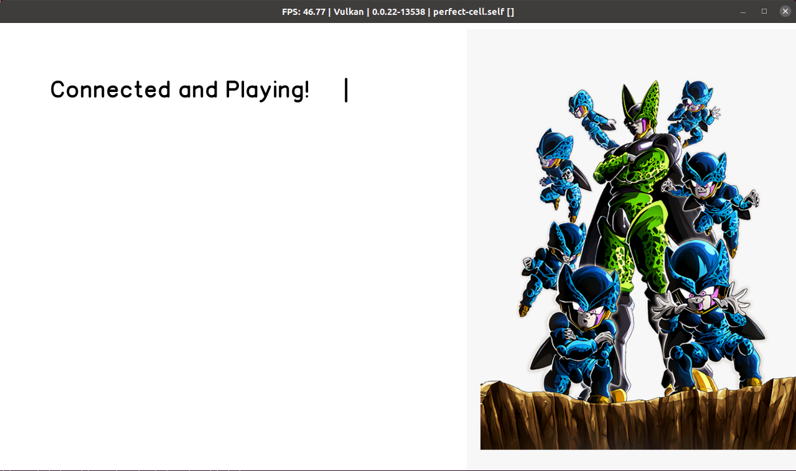

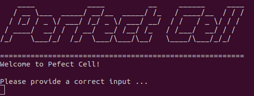

### Reverse

Now that we have recovered the ELF file file (thanks to RPCSC3) we can load it into Ghidra to reverse it. To improve the analysis of Ghidra, I found a some scripts on Github: https://github.com/clienthax/Ps3GhidraScripts.

The scripts were able to automatically rename some of the library functions used in the binary, in particular the networking functions: socket, recv, bind, accept, ...

The function starting at `0x11098` does most of the networking in the program. It creates the socket, listens for incomming connections, sends the banner to user and receives the input. At the end of this function some checks are made on the format of the input: ti should be of size 0x66, start with `FCSC{` and end with `}`, so the program is basically expecting a valid flag as an input.

The next of the check happens inside the function at `0x11350` (the main function). In fact, the Cell processor of the PS3 actually contains mutiple microprocessors:
- the PPU (PowerPC Processing Unit): the main processor, on which the code we are looking at is running;
- the SPUs (Synergistic Processing Units): 8 cores in theory, 7 in real life, that can be used by the PPU to run programs.

Here the main function makes uses the SPUs to check the part of the flag between the brackets (0x60 characters). It first loads some program and the flag in their memory, launch threads on the SPUs and retreives the result to check it. in the end, the `memcmp` function is called to check the result of the SPU operations against an expected value.

### Strategy

At this point in the challenge, I took a few things in consideration:
- This challenges looked very similar to a challenge from previous year called `Start 2nd Mix: Crypto Edition`, which was about reversing a Dreamcast game with some of the code running on the main processor and some other running on the sound card (you can find a write-up of this challenge in this repository). I could maybe use some experience from this previous challenge, and also I wanted to find a different way to solve this one;
- I was afraid to have to install another toolchain to reverse the code running on the SPUs, and my disk was already full of toolchains from the other reverse challenge of FCSC 2022.

With that in mind, I decided to try a different approach, than the intended one (reverse the SPU code to get the flag): what if we coud solve the challenge by only looking at the PPU part ?

### Instrumentation

I decided to check the values passed to `memcmp` after the SPUs had processed the input. The gbd from RPCS3 was not working, so instead I patched the extract ELF file to replace the call to `memcmp` by a call to `send`. This way by patching the arguments of the function call, I was able to retreive the check value, and then the result of the SPU operations.

Here is the orinal call to memcmp:
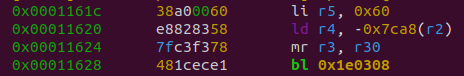

Here is the patched version to call `send(check_data)`:
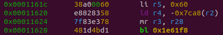

Here is the patched version to call `send(SPU_result)`:
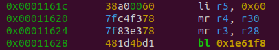

With this patch, I decided to check the impact that changing one bit in the input would have on the SPU output. After a few manual checks I noticed that a one bit change in the output affected only one byte of the output, so there might be a way to bruteforce the bits of the flag in a specific way.

Before going further, we need to automate the process of sending an input to the PS3 binary and retrieving the output on the SPU socket. I created a python script which:
1. Starts the emulator without the graphical interface (with the `--no-gui` option) and runs the patched binary;
2. Waits a few seconds;
3. Connects to the socket on port 1337, sends the input and receives the SPU on the socket (thanks to the patched binary).

### Bit Analysis

Now that everything is set up, we need to determine which bit of the input affects which byte of the output. I first tried to send inputs full of null bytes and setting one bit at the time, and then I tried the opposite, inputs where all bits are set and only one unset at the time. This resulted in 2 dictionnaries mapping the output bytes to the input bits. Unfortunately, theses two dictionnaries differ for some bytes, which means that some of the operations do mix the input more than others.

We can still deduce some useful information from these results:
- Most of the output bytes depend only on 8 bits of the input: we can try to bruteforce these ones first;
- The input can be be divided in 6 blocks of 0x10 bytes that affect the corresponding 0x10 bytes of the output (the first 0x10 bytes of the output only depends on the first 0x10 bytes of the input ans so on);
- The blccks 2 and 6 ([0x10:0x20] and [0x50:0x60]) seems to have a more links between the bits of the input than the other blocks, which seem to have a similar behaviour;

### Bruteforce

From there, the bruteforce strategy is quite simple: choose a set of 8 bits (or more) that affects one byte of the output, and bruteforce them until the output byte corresponding to the check value is found.

In theory this process should be quite straightforward, but in reality there where some difficulties (for block 2 mostly): because some output bytes depends on more than 8 bits, if we find a wrong value for these bits, they will be fixed to incorrect values during the bruteforce of another output bytes. This required some manual fixing of the results and changing the order in which the output bytes (corresponding input bits) where bruteforced until all the correct bits where found.

The bruteforce process was also really long, because testing one possible configuartion for the bits of one output byte requires to start the emulator, and then wait for the program to start and create the socket, which took about 4/5 seconds each time.

I used a few optimisations to speed up the process:
- Initially there was a sleep of 5 seconds at the end of the PS3 program, so I patched it to make the game exit quicker;
- The bytes of the input are supposed to form a flag made of ascii characters at the end, so we can constrain the most significant bit of each input byte to be null.

In the end, I was able to recover the flag using this method, which took about 1 day of bruteforce and a lot of manual tweaking of the bruteforce order:

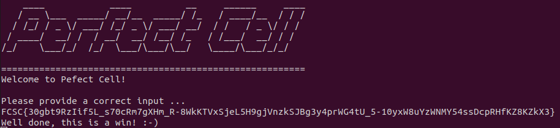

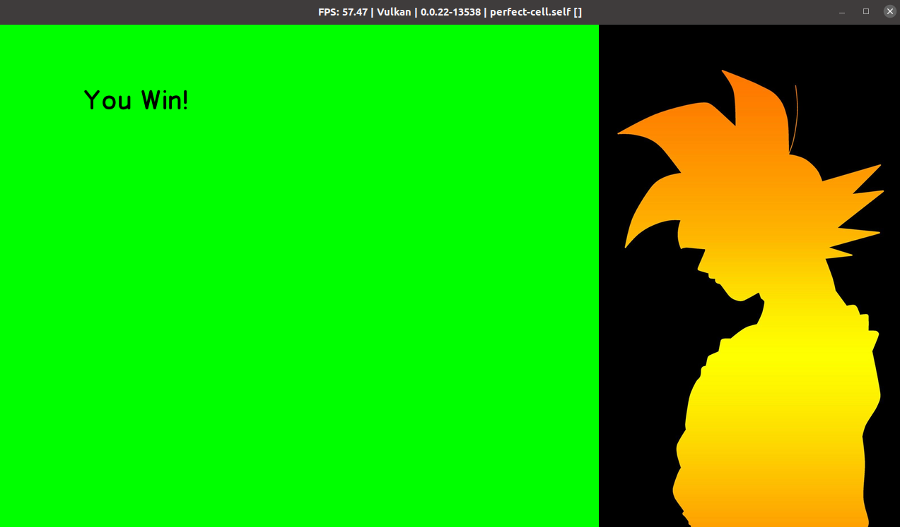

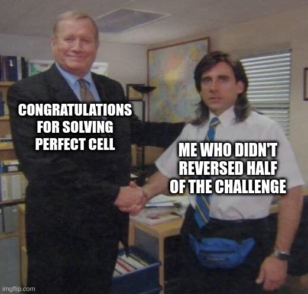
